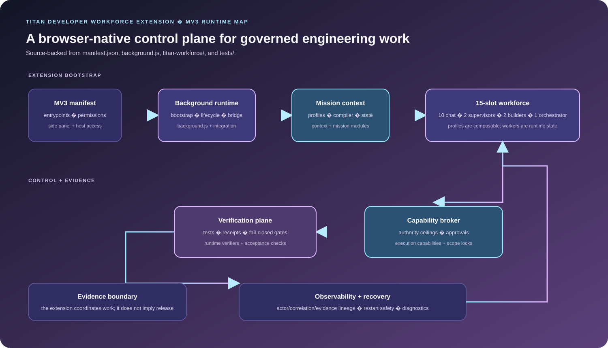

<div align="center">

# Titan Developer Workforce Extension

**A Manifest V3 browser-extension workspace that seeds a governed 15-slot AI engineering workforce and routes work through explicit orchestration, review and verification contracts.**

</div>

This repository evolves Titan Code 3 into a development workforce with explicit roles for Chat workers, Work supervisors, Codex builders and a Codex orchestrator. The implemented code is a migration and integration workspace: it contains the extension seed, workforce state modules, pipeline contracts, tests and architecture records. The complete 15-slot acceptance target is documented, but is not presented here as a released end-to-end workflow.

## Get started

Use a clean Chrome test profile and review extension permissions before loading the unpacked build.

1. Open `chrome://extensions` in Chrome or another Chromium-based browser.
2. Enable **Developer mode**.
3. Select **Load unpacked** and choose the directory containing `manifest.json`.
4. Reload the extension after source changes.

From the repository root, use Node.js 22 (the CI workflow's runtime) for the bounded local checks:

```bash
node -e "JSON.parse(require('fs').readFileSync('hehggadaopoacecdllhhajmbjkdcmajg/1.26.901.11451_0/manifest.json','utf8')); console.log('manifest PASS')"
node hehggadaopoacecdllhhajmbjkdcmajg/1.26.901.11451_0/tests/package-integrity.test.js
node hehggadaopoacecdllhhajmbjkdcmajg/1.26.901.11451_0/titan-work-codex-pipeline-selftest.js
node hehggadaopoacecdllhhajmbjkdcmajg/1.26.901.11451_0/codex-sidepanel/titan-workforce/core-selftest.mjs
```

The full regression map is [developer-workforce-regression.yml](.github/workflows/developer-workforce-regression.yml). Acceptance certification, packaging and live extension smoke are separate evidence lanes.

## What is implemented

- **15-slot control model:** 10 Chat workers in two squads of five, 2 Work supervisors, 2 Codex builders and 1 Codex orchestrator.
- **Composable workforce profiles:** roughly 50 specialist profiles describe expertise, architecture context, capability ceilings, risk hints and output/verification expectations. Profiles are inputs to selection; they are not extra live workers.
- **Busy-safe scheduling:** the workstream contract defines five-minute minimum gates, staggering and no interruption of busy workers.
- **Work-to-Codex pipeline:** the checked-in contracts name CycleReview, ApprovedImplementationDelta, BuilderResult and orchestrator routes such as COMPLETE, REPAIR, RESEARCH, VERIFY and BLOCKED.
- **Evidence lineage:** the repository preserves Mission → Chat passes → Work review → Approved Delta → Codex → Orchestrator → verification, with actor, correlation and evidence identifiers treated as core invariants.
- **Recovery-oriented runtime modules:** the side-panel workforce tree contains mission, review, verification, observability and recovery modules behind the background runtime.

Titan is the deterministic control plane: it assigns work, bounds capabilities, tracks state and evidence, and applies verification expectations. This is a governed extension architecture, not a claim that browser-provider sessions or autonomous production execution are already complete.

## Architecture

<p align="center">
  
</p>

The diagram is a source-backed map of the extension runtime: composable profiles feed runtime workers, the control plane bounds authority, and verification/evidence remain explicit.

## Code map

- [manifest.json](hehggadaopoacecdllhhajmbjkdcmajg/1.26.901.11451_0/manifest.json) defines the MV3 entry points, permissions, side panel and host access.
- [background.js](hehggadaopoacecdllhhajmbjkdcmajg/1.26.901.11451_0/background.js) owns background bootstrap and dynamic entrypoint wiring.
- [codex-sidepanel/titan-workforce/](hehggadaopoacecdllhhajmbjkdcmajg/1.26.901.11451_0/codex-sidepanel/titan-workforce/) contains workforce state, mission, review, verification, observability and recovery modules.
- [tests/](hehggadaopoacecdllhhajmbjkdcmajg/1.26.901.11451_0/tests/) contains package-integrity, runtime-smoke and acceptance checks.
- [AGENTS.md](AGENTS.md) records branch discipline, work packages and fail-closed invariants; [WORKSTREAMS.md](WORKSTREAMS.md) is the concise implementation map.

## Evidence and limitations

The deterministic self-tests demonstrate local contracts and state transitions. They do not prove provider-page compatibility, an authenticated live ChatGPT session, browser sleep/wake behavior, full 15-slot acceptance, or release readiness. Use the relevant workflow run and acceptance evidence before making those claims.

The project is intentionally retained as an active supporting workspace for the Titan ecosystem. Its runtime and acceptance surface are still being migrated; the documented target architecture should be read alongside the current tests and CI evidence.

## Provenance and status

**Active migration and implementation workspace.** This is separate from the Titan Zero business application: it is the development workforce used to help build and verify that system.

The repository retains its existing provenance, branding assets and project-specific documentation. No license, attribution or source-runtime claims are changed by this README rewrite.
